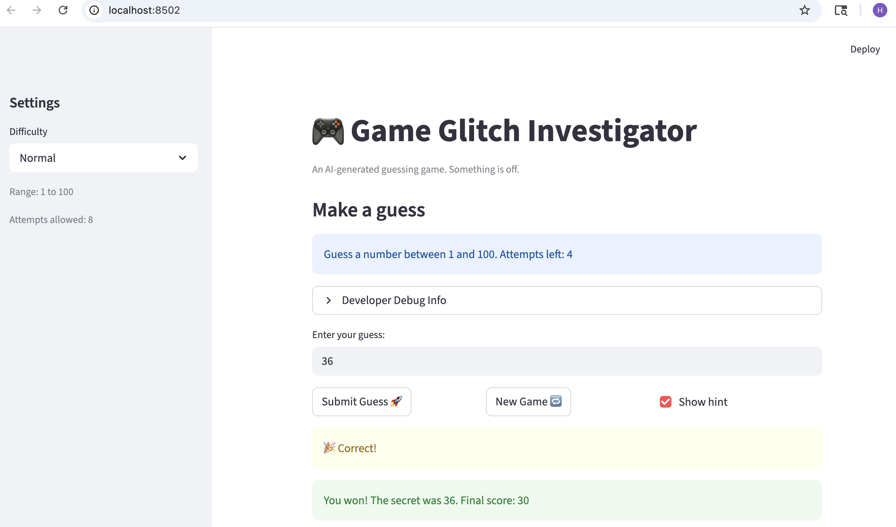
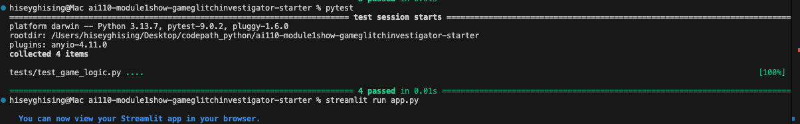

# 🎮 Game Glitch Investigator: The Impossible Guesser

## 🚨 The Situation

You asked an AI to build a simple "Number Guessing Game" using Streamlit.
It wrote the code, ran away, and now the game is unplayable. 

- You can't win.
- The hints lie to you.
- The secret number seems to have commitment issues.

## 🛠️ Setup

1. Install dependencies: `pip install -r requirements.txt`
2. Run the broken app: `python -m streamlit run app.py`

## 🕵️‍♂️ Your Mission

1. **Play the game.** Open the "Developer Debug Info" tab in the app to see the secret number. Try to win.
2. **Find the State Bug.** Why does the secret number change every time you click "Submit"? Ask ChatGPT: *"How do I keep a variable from resetting in Streamlit when I click a button?"*
3. **Fix the Logic.** The hints ("Higher/Lower") are wrong. Fix them.
4. **Refactor & Test.** - Move the logic into `logic_utils.py`.
   - Run `pytest` in your terminal.
   - Keep fixing until all tests pass!

## 📝 Document Your Experience

- [ ] Describe the game's purpose.
- [ ] Detail which bugs you found.
- [ ] Explain what fixes you applied.
## 📝 Document Your Experience

This game is a Streamlit-based number guessing game where the player tries to guess a randomly generated number within a limited number of attempts. The game includes difficulty levels, scoring, and hints to guide the player.
While testing the game, I found several bugs. The main issue was that the hint logic was reversed, when the guess was too high, the game incorrectly told the player to go higher. I also noticed that the attempt counter was off at the start and that the new game did not always respect the selected difficulty range.
To fix these issues, I corrected the hint logic in the "check_guess" function so that it gives the correct direction. I also ensured the attempt counter starts at 0 and that a new game correctly uses the selected difficulty range. I verified these fixes using pytest and by manually testing the game in Streamlit.

## 📸 Demo

- [ ] [Insert a screenshot of your fixed, winning game here]

## 🚀 Stretch Features

- [ ] [If you choose to complete Challenge 4, insert a screenshot of your Enhanced Game UI here]
